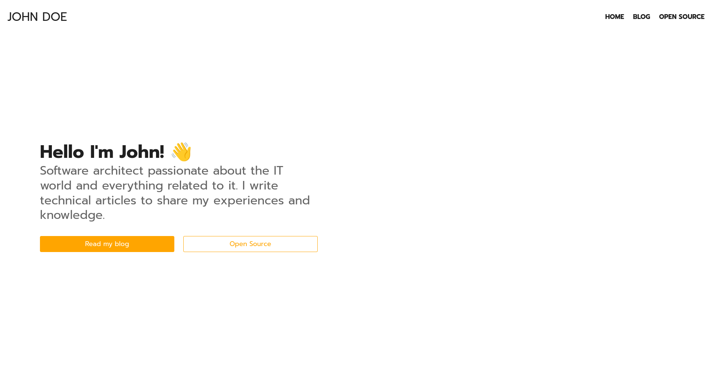

# Astro Minimal 😎

Astro Minimal is an open source blog template designed and developed using Astro and the Bulma CSS framework 🚀

## Demo

[Click here](https://demo-astro-minimal.netlify.app/) for the production website.

## Feedback
If you have feedback or have encountered any problems or bugs, feel free to open an issue in the dedicated section 🤞

## Misc.
This template used to power [my personal site](https://domenicotenace.netlify.app), that you can find in "personal-blog" branch of this repository.

## License
[MIT](https://choosealicense.com/licenses/mit/)